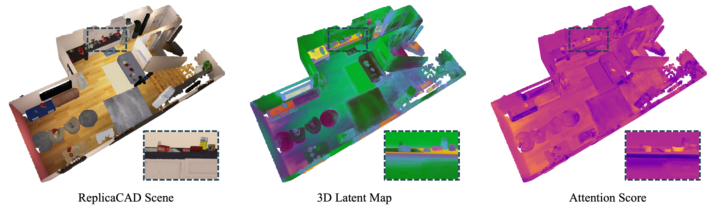

# SBP
## Seeing the Bigger Picture: 3D Latent Mapping for Mobile Manipulation Policy Learning

<p align="center">
  <a href="https://existentialrobotics.org/sbp_page/">Project Page</a> |
  <a href="https://arxiv.org/abs/2510.03885">Paper</a>
</p>

<p align="center">
  
</p>

Official implementation of **SBP (Seeing the Bigger Picture)** (ICRA 2026).

---

## Table of Contents
- [Installation](#installation)
- [Mapping Dataset Generation](#mapping-dataset-generation)
- [Latent Mapping](#latent-mapping)
- [Map-Conditioned Policy Learning](#map-conditioned-policy-learning)
- [Acknowledgement](#acknowledgement)
- [Citation](#citation)

## Installation

```bash
git clone --recursive https://github.com/ExistentialRobotics/SBP.git
bash setup.sh
conda activate sbp
```

All dependencies including PyTorch Geometric and xformers are installed automatically by `setup.sh`.

## Mapping Dataset Generation

### 1. Generate RGB-D Dataset
Render RGB-D data from ManiSkill environments using camera poses in `dataset/camera_params/`. Output is HDF5.
```bash
python dataset/render_from_camera_poses.py \
    --task set_table --build_config_idx 37 --task_plan_idx 0 --output_dir data/mapping
```
See the [mshab repository](https://github.com/arth-shukla/mshab) for details on task parameters.

### 2. Generate Vision Embeddings
Extract DINOv3 or EVA-CLIP embeddings and write them back to the HDF5 file.
```bash
python dataset/generate_embedding.py --model eva_clip \
    --input_path data/mapping/set_table/<episode_name>.hdf5
```

## Latent Mapping

Train the latent map on the generated HDF5 dataset:
```bash
python mapping/train_latent_map.py --config mapping/config/config.yaml
```
Override paths with `--dataset_dir` and `--output_dir`.
Visualize results at `localhost:8080` via Viser.

To train on multiple episodes, place all `episode_*.hdf5` files in the same `--dataset_dir` directory — they will be loaded automatically.

## Map-Conditioned Policy Learning

Training a map-conditioned BC policy requires two prerequisites:
1. **Latent maps** — Train your own following the [Latent Mapping](#latent-mapping) section above, or download pre-trained maps:
    ```bash
    huggingface-cli download suk063/SBP models --repo-type dataset --local-dir data/
    ```
    Pre-trained maps are available at: https://huggingface.co/datasets/suk063/SBP/tree/main/models

2. **Expert demonstrations** — Generated via PPO RL policies from the [mshab](https://github.com/arth-shukla/mshab) repository. You can download our pre-generated demonstrations from HuggingFace:
    ```bash
    huggingface-cli download suk063/SBP demonstrations --repo-type dataset --local-dir data/
    ```
    The full dataset is also available at: https://huggingface.co/datasets/suk063/SBP

### Training
Train a map-conditioned policy (e.g., `set_table` task):
```bash
python policy/train_bc.py policy/configs/set_table.yml \
    algo.data_dir_fp=<path_to_demo_data>
```

Task-specific configs are available under `policy/configs/` (e.g., `set_table.yml`, `prepare_groceries.yml`, `tidy_house.yml`).

Alternatively, use the provided training script which handles path setup, resumption, and environment configuration automatically:
```bash
bash scripts/run_train.sh set_table
```

### Evaluation
Evaluate a trained policy checkpoint:
```bash
python policy/eval.py policy/configs/set_table.yml \
    ckpt_path=<path_to_checkpoint>
```

Alternatively, use the provided evaluation script:
```bash
bash scripts/run_eval.sh set_table
```

## Acknowledgement

We thank the authors of [ManiSkill3](https://github.com/haosulab/ManiSkill) and [mshab](https://github.com/arth-shukla/mshab) for their open-source contributions!

## Citation

```bibtex
@article{kim2025seeing,
  title={Seeing the Bigger Picture: 3D Latent Mapping for Mobile Manipulation Policy Learning},
  author={Kim, Sunghwan and Chung, Woojeh and Dai, Zhirui and Bhatt, Dwait and Shukla, Arth and Su, Hao and Tian, Yulun and Atanasov, Nikolay},
  booktitle={IEEE International Conference on Robotics and Automation (ICRA)},
  year={2026}
}
```
